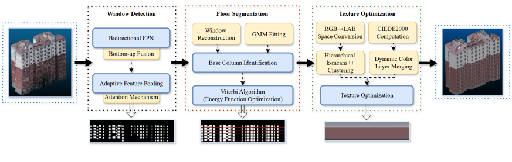
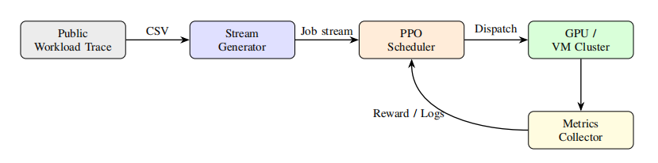
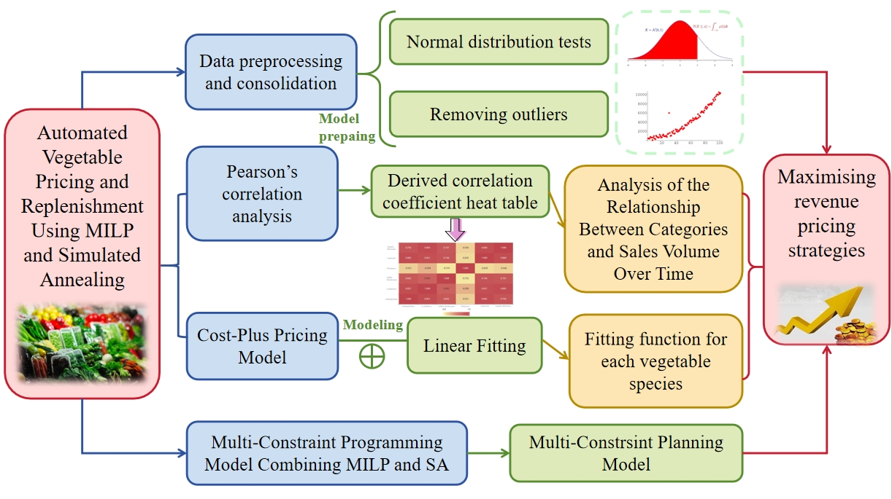








I am currently a Master's student at [Beijing Institute of Technology](https://www.bit.edu.cn/), supervised by Prof. [Yan Yan](http://mc.bit.edu.cn/szdw/qzjs/yanyan/index.htm). I received my B.E. degree from [Shenzhen MSU-BIT University](https://www.smbu.edu.cn/) in 2026.

My research interests lie at the intersection of **Artificial Intelligence**, **Large Language Model**, and **World Model**. I have published 3 papers as first/co-first author in top-tier journals and conferences including **IEEE JSTAR (SCI Q1)**, **IEEE CloudCom (EI)**, and **IEEE CAC (EI)**.

# 🔥 News
- *2025.12*: &nbsp;🎉 Our paper on fine-grained 3D building façade reconstruction is accepted by **IEEE JSTAR** (SCI Q1, Second Author).
- *2025.10*: &nbsp;🎉 Our paper on dual-objective parallel task scheduling via PPO is accepted by **IEEE CloudCom 2025** (Co-First Author).
- *2025.10*: &nbsp;🎉 Our paper on automated vegetable pricing using MILP & Simulated Annealing is accepted by **CAC 2025** (First Author).

# 📝 Publications

IEEE JSTAR 2025

[Fine-Grained 3D Reconstruction of Urban Building Façades via Window-Driven Semantic Parsing](#)

**Junhong He**, et al.

[**Project**](#) | **SCI Journal Paper (Q1)**
- *IEEE Journal of Selected Topics in Applied Earth Observations and Remote Sensing (JSTARS), 2025 — Accepted (Second Author)*

IEEE CloudCom 2025

[Dual-Objective Parallel Task Scheduling in Cloud Computing via PPO](#)

**Junhong He**✱, et al.

[**Project**](#) | **EI International Conference**
- *IEEE CloudCom, 2025 — Accepted (Co-First Author)*

IEEE CAC 2025

[Automated Vegetable Pricing and Replenishment Using MILP and Simulated Annealing](#)

Junhong He, et al.

[**Project**](#) | **EI International Conference**
- *Proceedings of the Chinese Automation Congress (CAC 2025), IEEE — Accepted (First Author)*

# 🎖 Honors and Awards
- *2024.10* National Scholarship (Top 2% of all undergraduates nationwide)
- *2023-2026* First-Class Academic Scholarship, Shenzhen MSU-BIT University
- *2023.11* First Prize, Contemporary Undergraduate Mathematical Contest in Modeling (CUMCM) in Guangdong province
- *2023.12* Merit Student, Beijing Institute of Technology
- *2023-2026* Merit Student, Shenzhen MSU-BIT University

# 📖 Educations
- *2026.09 - Present (now)*, M.S., School of Computer Science, [Beijing Institute of Technology](https://www.bit.edu.cn/), Beijing, China.
- *2022.09 - 2026.06*, B.E., [Shenzhen MSU-BIT University](https://www.smbu.edu.cn/), Shenzhen, China. (GPA: 3.93(3/179), Outstanding Graduate)
- *2023.01 - 2023.06*, Exchange Student, [Beijing Institute of Technology](https://www.bit.edu.cn/), Beijing, China.

# 🔬 Research Experience
- *2026.01 - 2026.06*, Research Assistant, Medical Imaging Processing Laboratory, Shenzhen MSU-BIT University, Shenzhen, China.
  - Worked on depression risk factor identification from multimodal data using machine learning in the task of predicting pathological complete response(pCR) for head and neck squamous cell carcinoma(HNSCC).

# 💻 Internships
- *2023.07 - 2023.09*, Intern, Taxation Bureau of Longgang District, Shenzhen, China.
  - Assisted in data analysis and digital transformation projects for tax administration.
